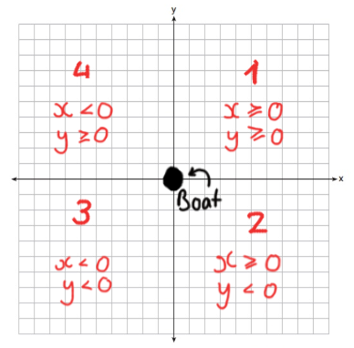
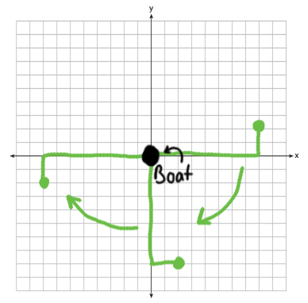

# [Day 12: Rain Risk](https://adventofcode.com/2020/day/12)

### Part two explanation

In order to rotate the waypoint around the boat, a system of quadrants is used.

Imagine the boat is on the origin of a set of axis. Using those axis, you can define a set of quadrants based on the values of *x* and *y*



If you have a set of coordinates that represent a waypoint's offset from the boat, you can determine what quadrant it lies in relative to the boat based on the parameters shown in the image.

Because we will only ever be asked to rotate the waypoint a multiple of 90 degrees around the boat, we can determine the number of the quadrant after the rotation has been done by dividing the number of degrees by 90 and adding or subtracting that value from the quadrant number depending on which way we're turning the waypoint.

If the quadrant number has gone above four or below zero, we can subtract or add four respectively in order to bring the quadrant number back within `1 <= x <= 4`.

Next, we switch the `x` and `y` values around if the quadrants are diagonally opposite each other (so if the modulus of the difference between the old and new quadrants is not zero). This is to compensate for the fact that a vector is essentially vertically flipped when rotated 180 degrees.



Finally, we can make the values for `x` and `y` positive and negative according to the rules for each quadrant. For example, if the new quadrant is quadrant number two, we have to make the `x` and `y` values positive or negative so that `x >= 0 and y < 0` is true.

The better way to do this (for angles that aren't just multiples of 90) is to use a transformation matrix and trigonometry.

When I say "the better way", I mean the _much_ better way.

### Related

* [Computerphile - Using transformation matrices for rotation](https://youtu.be/vQ60rFwh2ig?t=240)

### Visualisation

| Part one                       | Part two                       |
| ------------------------------ | ------------------------------ |
|  |  |

---

<details><summary>Script output</summary>

```
❯ python .\python\
AoC 2020: day 12 - Rain Risk
Python 3.8.5

Test cases
1.1 pass
2.1 pass

Answers
Part 1: 1645
Part 2: 35292

❯ go run .\go\
AoC 2020: day 12 - Rain Risk
Go go1.15.2

Test cases
1.1 pass
2.1 pass

Answers
Part 1: 1645
Part 2: 35292
```

</details>
