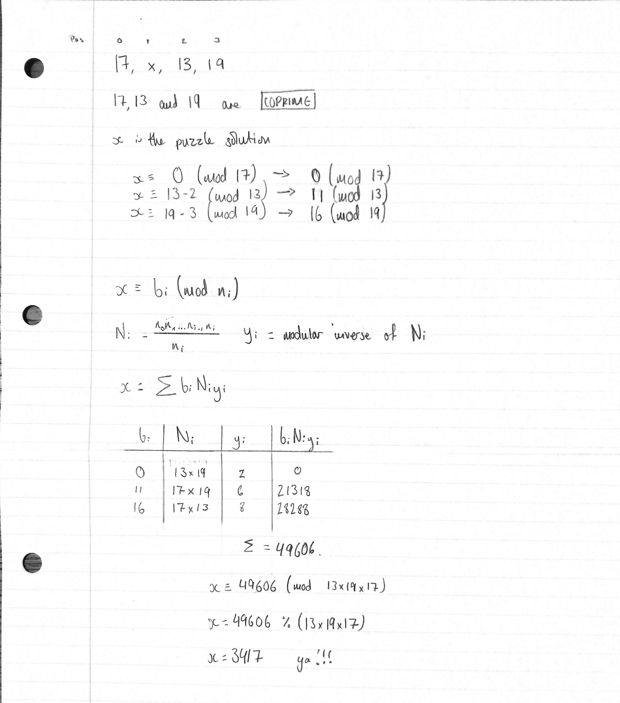

# [Day 13: Shuttle Search](https://adventofcode.com/2020/day/13)

No, I don't really know why the maths works, but it works!

Here are the notes I made for part two to work this out for a test case before implementing it for the first time to make sure that my method worked.



### Related

* [Maths with Jay - Chinese remainder theorem](https://www.youtube.com/watch?v=zIFehsBHB8o)
* [StackOverflow - Modular multiplicative inverse function in Python](https://stackoverflow.com/a/9758173)

<details><summary>Script output</summary>

```
❯ python .\python\
AoC 2020: day 13 - Shuttle Search
Python 3.8.5

Test cases
1.1 pass
2.1 pass
2.2 pass
2.3 pass
2.4 pass
2.5 pass
2.6 pass

Answers
Part 1: 4782
Part 2: 1118684865113056
```

</details>
