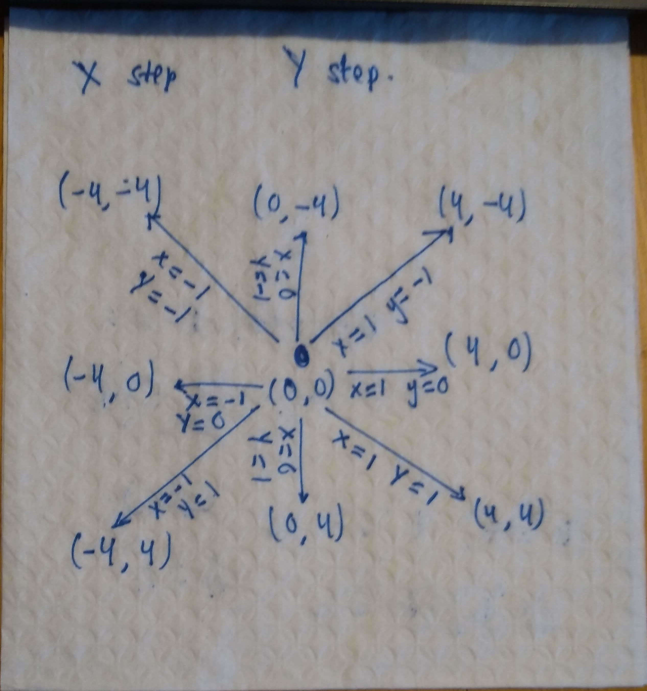

# [Day 5: Hydrothermal Venture](https://adventofcode.com/2021/day/5)

### Part one

* Parse input and output a list of pairs of points.
* Remove diagonal lines by filtering the list using the condition that `p1.x == p2.x or p1.y == p2.y`
* Count overlapping points
    * Create a dictionary that uses the point coordinate as a key and contains an integer `n` for each key
    * Iterate over each line in the input, adding 1 to `n` for each coordinate in the line
        * The coordinates were founid by computing the x and y deltas between the two points that made up the line
        * The sign of the deltas determines the direction we step in
        * We then step through each point in the line based on the step directions until the final point is encountered
    * Iterate over all keys in the dictionary and count every point where `n > 1`

### Part two

The same as part one, but without the list filtering step.

---

Involved literal napkin maths.

