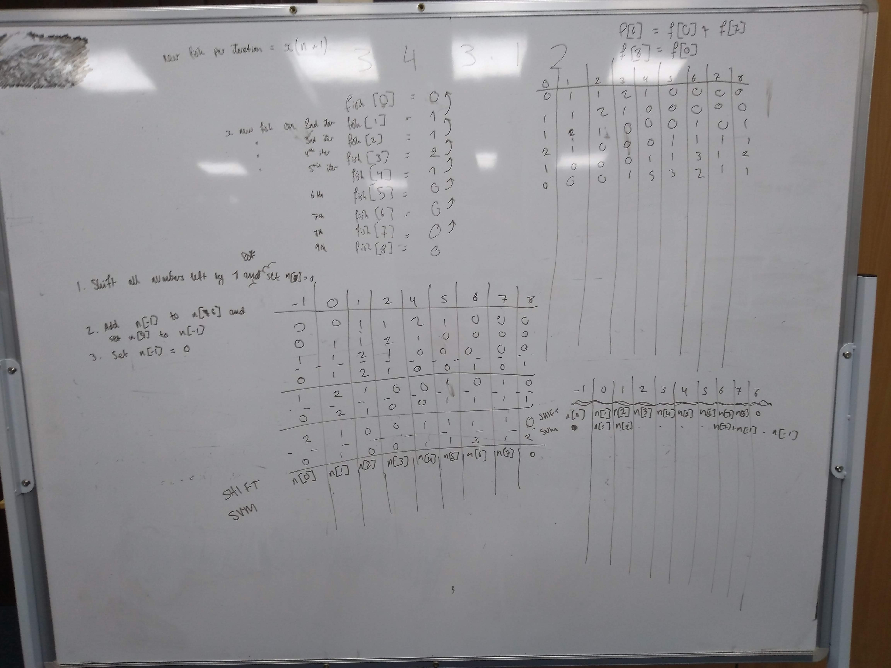

# [Day 6: Lanternfish](https://adventofcode.com/2021/day/6)

First, parse the input data into a usable form. Count the number of fish with each possible timer value (a given fish timer `t` must satisfy `0 <= t <= 8`). Then, iterating can begin.

A single iteration does the following (in this case, the example input `3,4,3,1,2` is being used):

|                                                                                                                            | -1  | 0   | 1   | 2   | 3   | 4   | 5   | 6   | 7   | 8   |
| -------------------------------------------------------------------------------------------------------------------------- | --- | --- | --- | --- | --- | --- | --- | --- | --- | --- |
| Initial starting timer frequencies                                                                                         |     | 0   | 1   | 1   | 2   | 1   | 0   | 0   | 0   | 0   |
| Shift input left                                                                                                           | 0   | 1   | 1   | 2   | 1   | 0   | 0   | 0   | 0   |     |
| Add the value of -1 to the value of 6, and set the value of 8 to be equal to the value of -1, then remove the value for -1 |     | 1   | 1   | 2   | 1   | 0   | 0   | 0   | 0   | 0   |
|                                                                                                                            |     |     |     |     |     |     |     |     |     |     |
| Repeat                                                                                                                     |     | 1   | 1   | 2   | 1   | 0   | 0   | 0   | 0   | 0   |
| Shift input left                                                                                                           | 1   | 1   | 2   | 1   | 0   | 0   | 0   | 0   | 0   |     |
| Add values                                                                                                                 |     | 1   | 2   | 1   | 0   | 0   | 0   | 1   | 0   | 1   |
|                                                                                                                            |     |     |     |     |     |     |     |     |     |     |
| Repeat                                                                                                                     |     | 1   | 2   | 1   | 0   | 0   | 0   | 1   | 0   | 1   |
| Shift input left                                                                                                           | 1   | 2   | 1   | 0   | 0   | 0   | 1   | 0   | 1   |     |
| Add values                                                                                                                 |     | 2   | 1   | 0   | 0   | 0   | 1   | 1   | 1   | 1   |
|                                                                                                                            |     |     |     |     |     |     |     |     |     |     |
| Repeat                                                                                                                     |     | 2   | 1   | 0   | 0   | 0   | 1   | 1   | 1   | 1   |
| Shift input left                                                                                                           | 2   | 1   | 0   | 0   | 0   | 1   | 1   | 1   | 1   |     |
| Add values                                                                                                                 |     | 1   | 0   | 0   | 0   | 0   | 0   | 3   | 1   | 2   |
|                                                                                                                            |     |     |     |     |     |     |     |     |     |     |
| etc, etc.                                                                                                                  |     |     |     |     |     |     |     |     |     |     |

Eventually, after the desired number of iterations, you can sum all the frequency values to get the challenge answer.

---

I commandeered a whiteboard for this.

