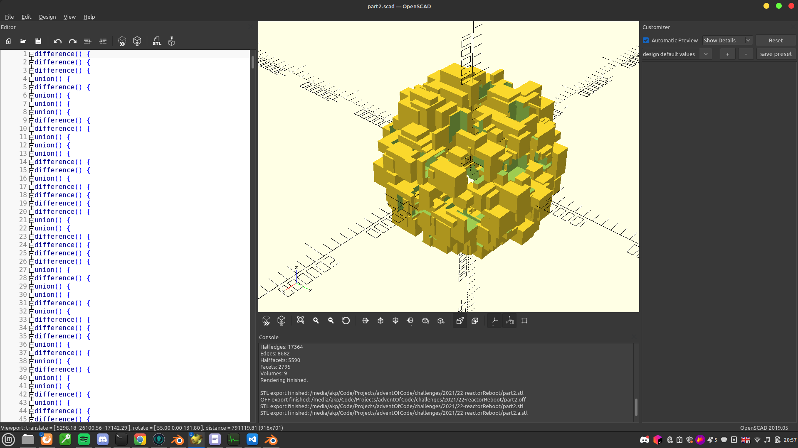
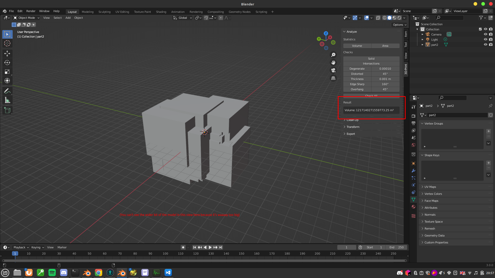

# [Day 22: Reactor Reboot](https://adventofcode.com/2021/day/22)

Today's solution is a little weird...

I solved part one using the easy, store every point method. However, for part two, I didn't want to go to the trouble of writing code to work out the intersections of all the cubes. Instead, I chose to do the following:

* Wrote some Python code (`openscad-generate.py`) to generate some [OpenSCAD](http://openscad.org/) code based on the challenge input
    * This made liberal use of nested `union()`, `difference()`, `translate()` and `cube()` functions
* Ran this code in OpenSCAD and exported the resultant model as an STL
* Imported this STL file into Blender and used the 3D-Print Toolbox addon to calculate the total volume of the object
* Typed this number into the AoC website
* Obtained the 2nd star ★ :D

