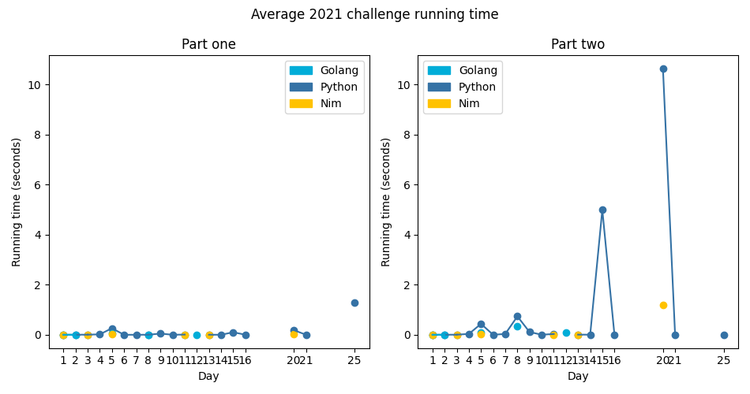

# Advent of Code 2021

Solutions to the [2021 Advent of Code](https://adventofcode.com/2021).

---

\* means that a given day has a visualisation

<!-- PARSE START -->

| Day                                 | Status             | Solutions                                                                                               | Notes                                                                                                                               |
| ----------------------------------- | ------------------ | ------------------------------------------------------------------------------------------------------- | ----------------------------------------------------------------------------------------------------------------------------------- |
| 01 - Sonar Sweep                    | Complete           | [Python](01-sonarSweep/py), [Go](01-sonarSweep/go), [Nim](01-sonarSweep/nim)                            | Numbers and sliding windows.                                                                                                        |
| 02 - Dive!                          | Complete           | [Python](02-dive/py), [Go](02-dive/go)                                                                  | Have this set of instructions and do something sensible with it.                                                                    |
| 03 - Binary Diagnostic              | Complete           | [Python](03-binaryDiagnostic/py), [Nim](03-binaryDiagnostic/nim)                                        | Bit twiddling aplenty!                                                                                                              |
| 04 - Giant Squid                    | Complete           | [Python](04-giantSquid/py)                                                                              | B-I-N-G-O, B-I-N-G-O, B-I-N-G-O and Bingo was his name-o!                                                                           |
| 05 - Hydrothermal Venture           | Complete           | [Python](05-hydrothermalVenture/py), [Go](05-hydrothermalVenture/go), [Nim](05-hydrothermalVenture/nim) | Pointy.                                                                                                                             |
| 06 - Lanternfish                    | Complete           | [Python](06-lanternfish/py)                                                                             | At this rate, the mass of the fish would surpass that of the Earth pretty quickly.                                                  |
| 07 - The Treachery of Whales        | Complete           | [Python](07-theTreacheryOfWhales/py)                                                                    | I'm not 100% sure my solution for part two is valid for all possible inputs.                                                        |
| 08 - Seven Segment Search           | Complete           | [Python](08-sevenSegmentSearch/py), [Go](08-sevenSegmentSearch)                                         | I may have taken the easy way out for part two, but it does work! No-one ever said the smart solution is the best solution, anyway. |
| 09 - Smoke Basin \*                 | Complete           | [Python](09-smokeBasin/py)                                                                              | Schmokey! Also, as it turns out, I struggle to implement basic logic. Fun.                                                          |
| 10 - Syntax Scoring                 | Complete           | [Python](10-syntaxScoring/py)                                                                           | I can't say I've ever broken something so thoroughly that it has a syntax error on *every* line...                                  |
| 11 - Dumbo Octopus                  | Complete           | [Python](11-dumboOctopus/py), [Nim](11-dumboOctopus/nim)                                                | Cellular automata my beloved <3                                                                                                     |

<!-- PARSE END -->

---

