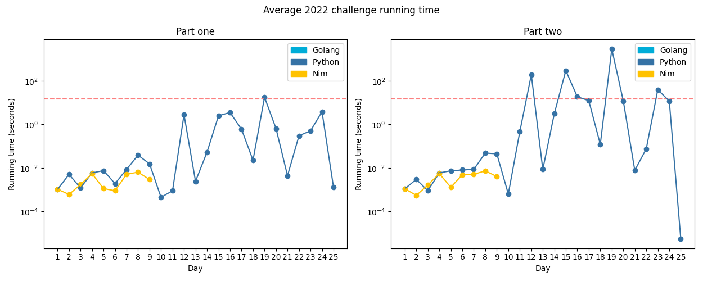

# Advent of Code 2022

Solutions to the [2022 Advent of Code](https://adventofcode.com/2022).

---

The red dotted line denotes 15 seconds.

---

\* means that a given day has a visualisation

<!-- ★ ☆ -->

| Day                                 | Status             | Solutions  | Notes  |
| ----------------------------------- | ------------------ | ---------- | ------ |
| 01 - Calorie Counting               | ★ ★                | [Python](01-calorieCounting/py/__init__.py), [Nim](01-calorieCounting/nim/challenge.nim), [Java](01-calorieCounting/java/src) | Summing numbers |
| 02 - Rock Paper Scissors            | ★ ★                | [Python](02-rockPaperScissors/py/__init__.py), [Nim](02-rockPaperScissors/nim/challenge.nim) | Programmatically playing Rock Paper Scissors |
| 03 - Rucksack Reorganization        | ★ ★                | [Python](03-rucksackReorganization/py/__init__.py), [Nim](03-rucksackReorganization/nim/challenge.nim) | Sets and intersections |
| 04 - Camp Cleanup                   | ★ ★                | [Python](04-campCleanup/py/__init__.py), [Nim](04-campCleanup/nim/challenge.nim) | More sets and more intersections! |
| 05 - Supply Stacks                  | ★ ★                | [Python](05-supplyStacks/py/__init__.py), [Nim](05-supplyStacks/nim/challenge.nim) | Believe it or not, this one involved stacks. |
| 06 - Tuning Trouble                 | ★ ★                | [Python](06-tuningTrouble/py/__init__.py), [Nim](06-tuningTrouble/nim/challenge.nim) | This is the first year I've not repeatedly forgotten about the existence of sets, and it's coming in quite handy. |
| 07 - No Space Left On Device        | ★ ★                | [Python](07-noSpaceLeftOnDevice/py/__init__.py) | Turns out that fake file systems are prone to very subtle and infuriating bugs. |
| 08 - Treetop Tree House             | ★ ★                | [Python](08-treetopTreeHouse/py/__init__.py) | Magical coordinate dictionary tuple things do be magical. |
| 09 - Rope Bridge                    | ★ ★                | [Python](09-ropeBridge/py/__init__.py), [Nim](09-ropeBridge/nim/challenge.nim) | Does this count as this year's first cellular automata? |
| 10 - Cathode-Ray Tube               | ★ ★                | [Python](10-cathodeRayTube/py/__init__.py) | A nasty problem with a nasty solution and nasty outputs that mess with my framework. |
| 11 - Monkey in the Middle           | ★ ★                | [Python](11-monkeyInTheMiddle/py/__init__.py) | Return of Advent of Maths! |
| 12 - Hill Climbing Algorithm        | ★ ★                | [Python](12-hillClimbingAlgorithm/py/__init__.py) | Iiiiiiiiiiiiiiiit's Djikstra's! |
| 13 - Distress Signal                | ★ ★                | [Python](13-distressSignal/py/__init__.py) | Sorting some weird pairs of values with weird rules |
| 14 - Regolith Reservoir             | ★ ★                | [Python](14-regolithReservoir/py/__init__.py) | Simulating falling sand |
| 15 - Beacon Exclusion Zone          | ★ ★                | [Python](15-beaconExclusionZone/py/__init__.py) | Searching through a 4000000^2 size grid for a literal single empty spot |
| 16 - Proboscidea Volcanium          | ★ ★                | [Python](16-proboscideaVolcanium/py/__init__.py) | Nasty combinatorics |
| 17 - Pyroclastic Flow               | ★ ★                | [Python](17-pyroclasticFlow/py/__init__.py) | Detecting cycles in a large amount of knock-off Tetris. |
| 18 - Boiling Boulders               | ★ ★                | [Python](18-boilingBoulders/py/__init__.py) | Finding the surface area of a shape specified by a list of unit cubes. |
| 19 - Not Enough Minerals            | ★ ★                | [Python](19-notEnoughMinerals/py/__init__.py) | Finding the most effective sequence of operations to complete a specific task. |
| 20 - Grove Positioning System       | ★ ★                | [Python](20-grovePositioningSystem/py/__init__.py) | My hell is lined with circular sequences. |
| 21 - Monkey Math                    | ★ ★                | [Python](21-monkeyMath/py/__init__.py) | Trees of math with a fairly satisfying solution :D |