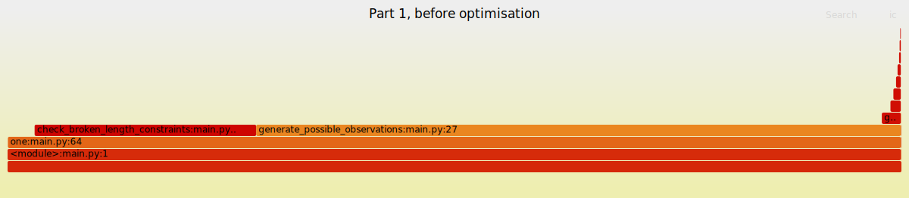

# [Day 12: Hot Springs](https://adventofcode.com/2023/day/12)

Before optimisation: 17.13 seconds for part 1

* Reduced allocations of strings by using the same instance of a list in `generate_possible_observations()`