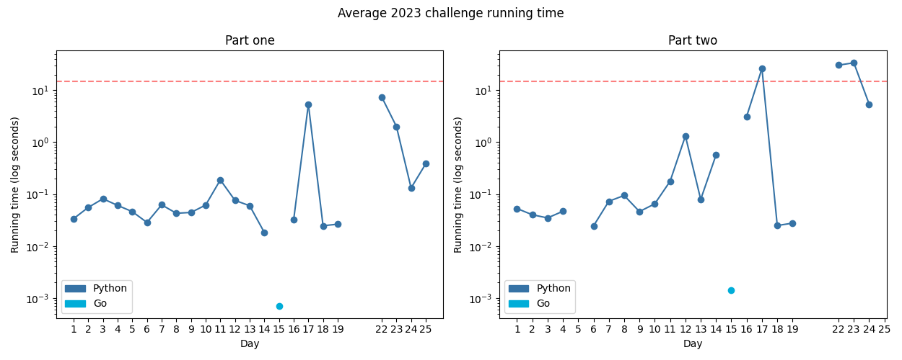

# Advent of Code 2023

Solutions to the [2023 Advent of Code](https://adventofcode.com/2023).

**Total stars: ★26**

---

<!-- ★ ☆ -->

A day denoted with a star means it has a visualisation.

| Day | Status | Solutions | Notes |
|-----|--------|-----------|-------|
| 01 - Trebuchet?! | ★ ★ | Python | I never knew detecting numbers could be so confusingly tricky |
| 02 - Cube Conundrum | ★ ★ | Python | Pleasingly straightforwards, though seems like it would be well suited to Haskell |
| 03 - Gear Ratios | ★ ★ | Python | First coordinate grid of the year! |
| 04 - Scratchcards | ★ ★ | Python | First flawed initial grok of the year |
| 05 - If You Give A Seed A Fertilizer | ★ ★ | Python | Gave up on the smart solution and brute-forced it backwards after 5 days of on-off trying. |
| 06 - Wait For It | ★ ★ | Python | Easy, GCSE-level maths :) |
| 07 - Camel Cards | ★ ★ | Python | Pedantic problem statements will be my downfall |
| 08 - Haunted Wasteland | ★ ★ | Python | I'm not sure any feasible generic solution exists - but I did work out the infeasible one! |
| 09 - Mirage Maintenance | ★ ★ | Python | GCSE maths and the n-th term coming in clutch right here |
| 10 - Pipe Maze | ★ ★ | Python | Thoroughly barked up two wrong trees then Googled an algo based on a thought and oops it just works? |
| 11 - Cosmic Expansion | ★ ★ | Python | Djikstra's and A* are the wrong way to do this (I tried both before engaging my brain) and then had to optimise various things for part 2 but nothing was horrendous. |
| 12 - Hot Springs | ★ ★ | Python | Some hints from the subreddit were needed but they got me well on my way to completing this. Memoisation is king, long live memoisation. |
| 13 - Point of Incidence | ★ ★ | Python | This one made me feel slightly intelligent. |
| 14* - Parabolic Reflector Dish | ★ ★ | Python | Why do I always overcomplicate cycle detection?! |
| 15 - Lens Library | ★ ★ | Go | Still took some brainpower but this time the brainpower was needed to work out what the problem was, *not* to work out how to solve the problem. |
