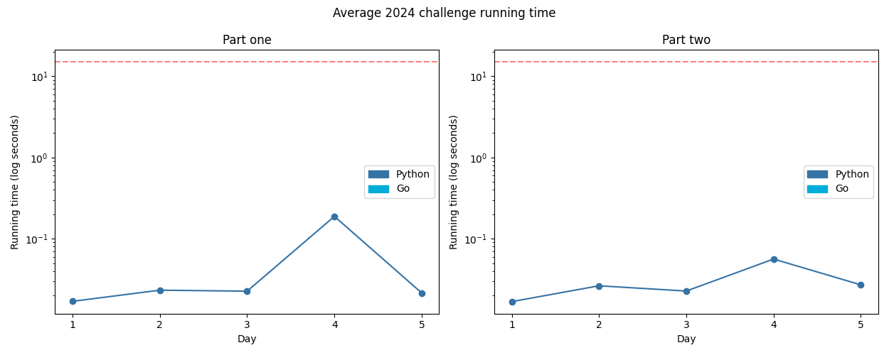

# Advent of Code 2024

Solutions to the [2024 Advent of Code](https://adventofcode.com/2024)!

---

Total stars: **16 ★**

<!-- ★ ☆ ✗ -->

A day denoted with an asterisk means it has a visualisation.

| Day                                 | Status | Solutions            | Notes |
|-------------------------------------|--------|----------------------|-------|
| 01 - Historian Hysteria             | ★ ★   | Python               | The reading comprehension was the hardest part of this. |
| 02 - Red-Nosed Reindeer             | ★ ★   | Python               ||
| 03 - Mull It Over                   | ★ ★   | Python               | The first instance of Advent of Parsing this year! |
| 04* - Ceres Search                  | ★ ★   | Python               | When it says a cross, it does not mean a plus. |
| 05 - Print Queue                    | ★ ★   | Python               | Before you dismiss and idea as being "too simple", make sure you check that it doesn't work. |
| 06 - Guard Gallivant                | ★ ★   | Python               | oh dear runtime (also I knew what I wanted to do for so long it just took me 3 hours to implement it properly) |
| 07 - Bridge Repair                  | ★ ★   | Python               | Maths? Backwards?? |
| 08* - Resonant Collinearity          | ★ ★   | Python               | `Fraction` saving us all from the curse of a computer's inability to do floating point arithmetic |