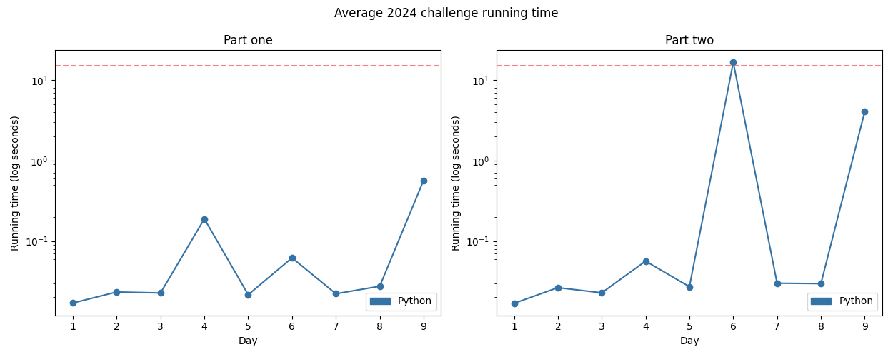

# Advent of Code 2024

Solutions to the [2024 Advent of Code](https://adventofcode.com/2024)!

---

Total stars: **0 ★**

<!-- ★ ☆ ✗ -->

A day denoted with a star means it has a visualisation.

| Day                                 | Status | Solutions            | Notes |
|-------------------------------------|--------|----------------------|-------|
| 01 - Historian Hysteria             | ★ ★   | Python               | The reading comprehension was the hardest part of this. |
| 02 - Red-Nosed Reindeer             | ★ ★   | Python               ||
