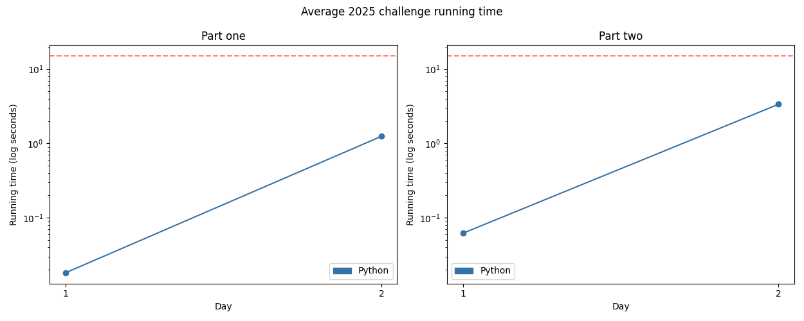

# Advent of Code 2025

Solutions to the [2025 Advent of Code](https://adventofcode.com/2025)!

---

Total stars: **12 ★**

<!-- ★ ☆ ✗ -->

A day denoted with an asterisk means it has a visualisation.

| Day                                 | Status | Solutions            | Notes |
|-------------------------------------|--------|----------------------|-------|
| 01 - Secret Entrance                | ★ ★    | Python               |       |
| 02 - Gift Shop                      | ★ ★    | Python               |       |
| 03 - Lobby                          | ★ ★    | Python               |       |
| 04 * - Printing Department          | ★ ★    | Python               |       |
| 05 - Cafeteria                      | ★ ★    | Python               | This felt like the first day where truly different approaches were possible. I'm quite proud of my part 2 algorithm! |
| 06 - Trash Compactor                | ★ ★    | Python               |       |